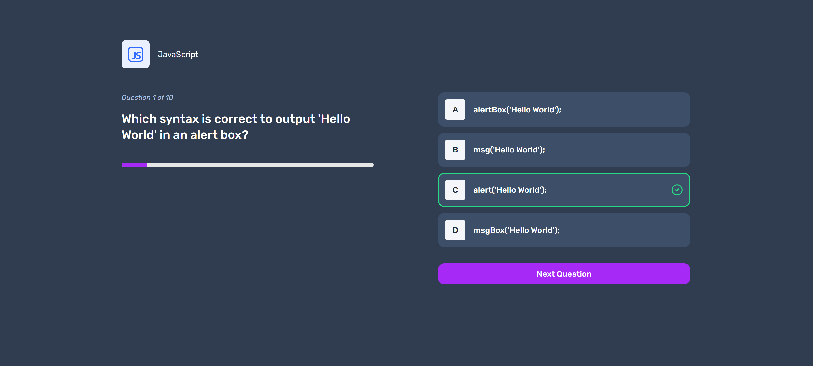

# Frontend Mentor - Frontend Quiz App

This is my solution to the [Frontend Quiz App challenge on Frontend Mentor](https://www.frontendmentor.io/challenges/frontend-quiz-app-BE7xkzXQnU). Frontend Mentor challenges help you improve your coding skills by building realistic projects. The design is provided by Frontend Mentor, all code is written by me.

Live Site URL: https://frontend-quiz-app-plum.vercel.app/

### Requirements

Users should be able to:

- Select a quiz subject
- Select a single answer from each question from a choice of four
- See an error message when trying to submit an answer without making a selection
- See if they have made a correct or incorrect choice when they submit an answer
- Move on to the next question after seeing the question result
- See a completed state with the score after the final question
- Play again to choose another subject
- View the optimal layout for the interface depending on their device's screen size
- See hover and focus states for all interactive elements on the page

### Goals

My goals in taking on this challenge included the following:

- Use React and TypeScript to build this challenge
- use Zustand and custom hooks for state management
- use Tailwind for styling

### Screenshots of my implementation of the desktop layout

